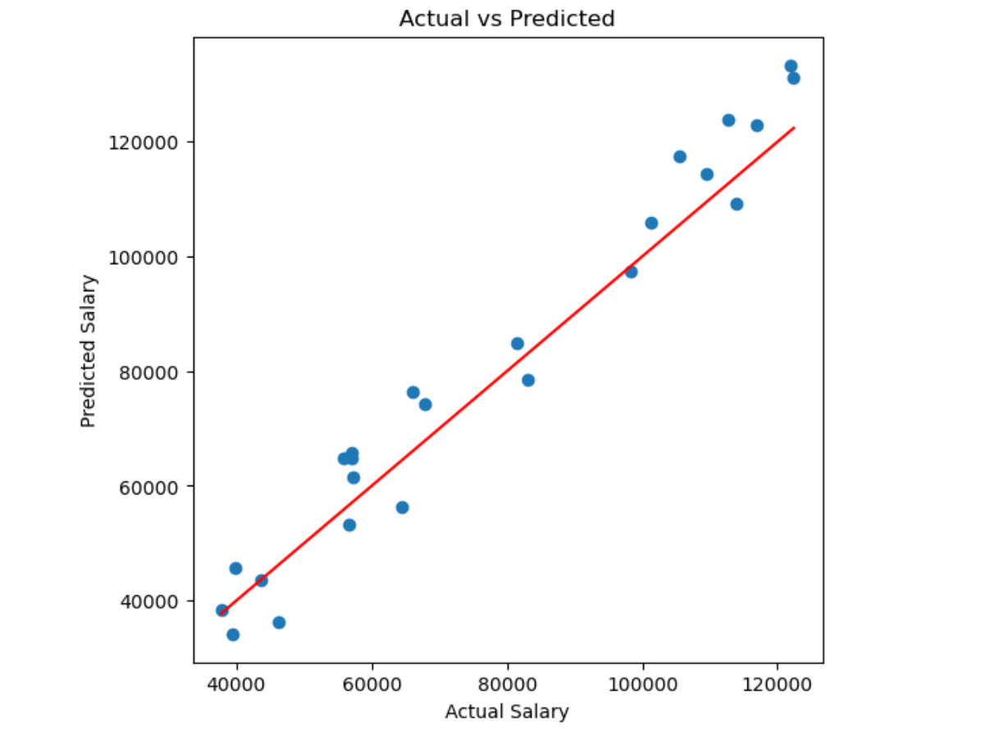
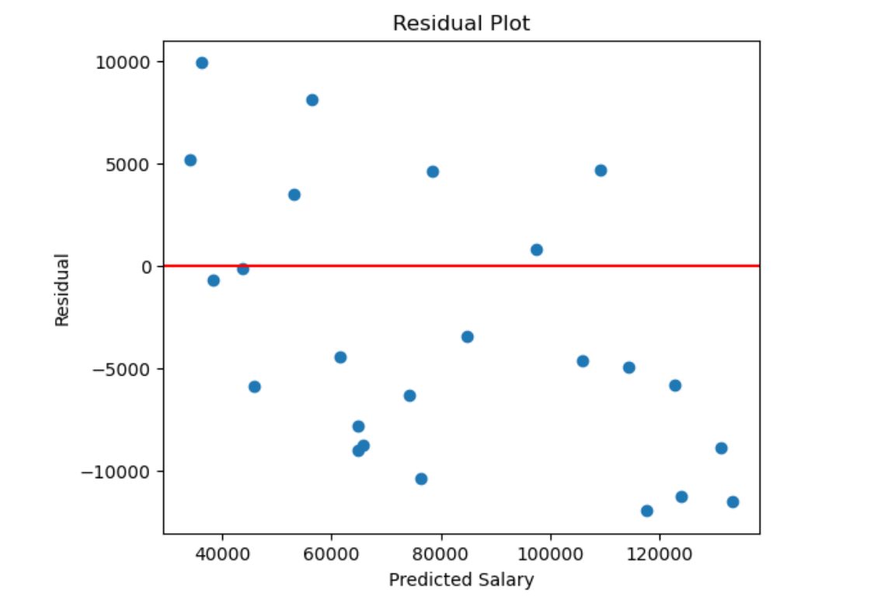

# 💼 Salary Predictor using Simple Linear Regression

## 📌 Overview

This project demonstrates how **Simple Linear Regression** can be used to predict an employee's salary based on years of experience.

The project covers the complete machine learning workflow, starting from loading the dataset to training the model, evaluating its performance, visualizing the regression line, and making salary predictions for new inputs.

It also includes the **manual mathematical derivation** of the regression equation and compares it with Scikit-learn's implementation.

---

# 🎯 Objectives

- Understand the intuition behind Simple Linear Regression.
- Implement Linear Regression using Scikit-learn.
- Learn how the regression line is calculated.
- Predict salaries for unseen years of experience.
- Evaluate the model using regression metrics.
- Visualize the regression line and predictions.

---

# 📂 Dataset

The dataset contains two columns:

- **YearsExperience**
- **Salary**

Example:

| Years of Experience | Salary |
|--------------------:|-------:|
| 1.1 | 39343 |
| 2.0 | 43525 |
| 3.9 | 63218 |
| 5.3 | 83088 |
| 10.5 | 121872 |

---

# 🛠 Technologies Used

- Python
- NumPy
- Pandas
- Matplotlib
- Scikit-learn
- Jupyter Notebook

---

# 📚 Project Workflow

### 1. Import Libraries

Load all required Python libraries.

---

### 2. Load Dataset

Read the salary dataset using Pandas.

---

### 3. Exploratory Data Analysis

- View dataset
- Dataset shape
- Summary statistics

---

### 4. Manual Linear Regression

Calculate:

- Slope (m)
- Intercept (b)

using the mathematical formulas:

\[
m=\frac{n\sum xy-\sum x\sum y}{n\sum x^2-(\sum x)^2}
\]

\[
b=\frac{\sum y-m\sum x}{n}
\]

---

### 5. Train-Test Split

Split the dataset into training and testing sets.

---

### 6. Train Linear Regression Model

Fit the model using Scikit-learn.

---

### 7. Model Prediction

Predict salary values for:

- Test dataset
- Custom user input

Example:

```
Experience : 5 Years

Predicted Salary : $75,340
```

---

### 8. Visualization

The notebook contains:

- Scatter Plot
- Regression Line
- Actual vs Predicted Plot

---

### 9. Model Evaluation

Performance is evaluated using:

- Mean Squared Error (MSE)
- Root Mean Squared Error (RMSE)
- Mean Absolute Error (MAE)
- R² Score

---

# 📈 Sample Results

Example prediction:

```
Input:

Years of Experience = 5

Predicted Salary

$75,340
```

Example Metrics

```
MSE

51,726,586

RMSE

7,192

MAE

6,362

R² Score

0.938
```

---

# 📊 Visualizations

The project includes:

- Salary vs Experience Scatter Plot
- Best Fit Regression Line
- Actual vs Predicted Salary Plot

---

# 📁 Project Structure

```
Salary Predictor
│
├── README.md
├── Salary_Predictor.ipynb
├── placement.csv
└── salary_prediction.png
```

---

# 🎓 Learning Outcomes

After completing this project, you will understand:

- Simple Linear Regression
- Regression Equation
- Slope and Intercept
- Model Training
- Model Prediction
- Regression Metrics
- Data Visualization
- Real-world Salary Prediction

---

# 🚀 Future Improvements

- Deploy using Streamlit
- Add salary prediction web application
- Save model using Pickle
- Add interactive user interface
- Use larger real-world datasets
# 📊 Project Visualizations

## Salary Prediction


---

## Actual vs Predicted



---

## Residual Plot



---

# ⭐ Conclusion

This project provides a complete beginner-friendly implementation of **Simple Linear Regression** using Python and Scikit-learn. It demonstrates how machine learning can be used to predict salaries based on years of experience while covering the underlying mathematics, model training, visualization, evaluation, and prediction.
